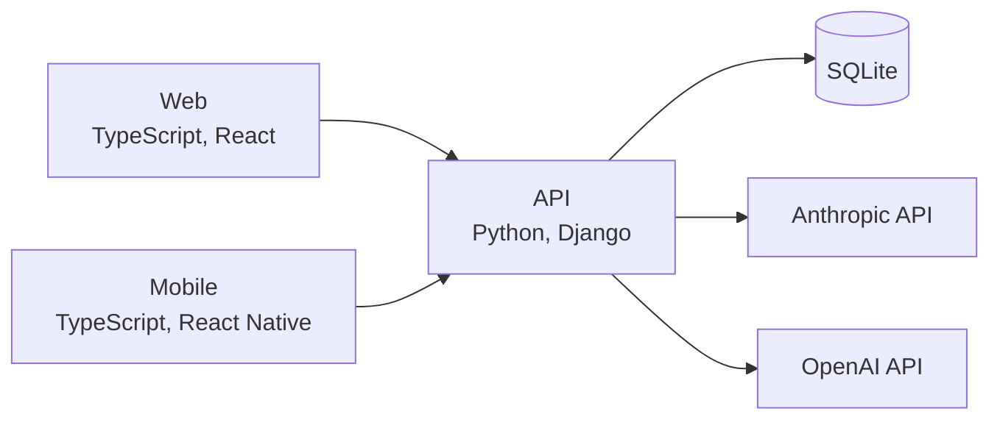

# apgrader

apgrader grades handwritten AP free response answers from photos, using the teacher's own question and rubric. A teacher uploads photos of the question and rubric from the web or mobile app, Claude extracts the text, and GPT-4o converts the rubric to JSON and scores a photographed student response part by part with reasoning.

